# Flutter Deer

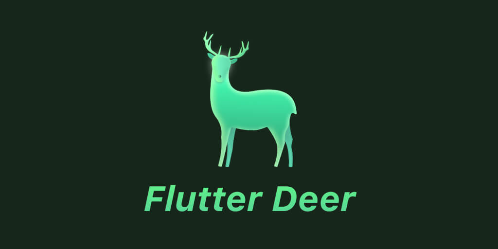

This project is an exercise project for individuals to learn Flutter.

Realize specific design effects by setting, modifying, combining self-contained widgets and customizing to meet the needs of daily development.

See the design catalog for the design drawings of this project.

## Preview

The effect of some pages is as follows:

|     |      |    |     |
| :--------------------------------: | :---------------------------------: | :-------------------------------: | :-------------------------------:  |
|     |  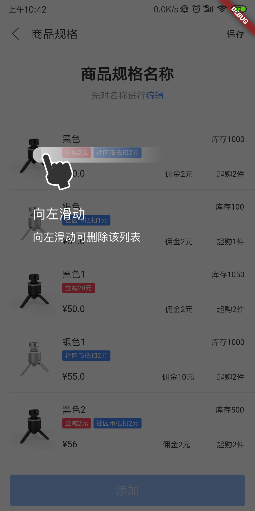    |    |  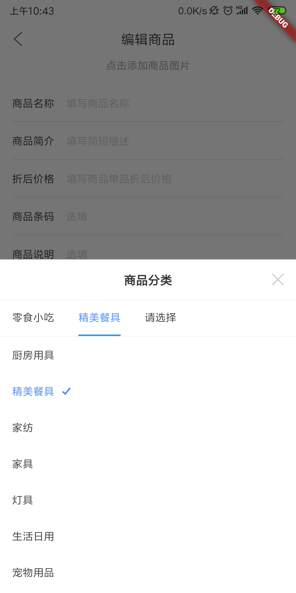   |
|     |  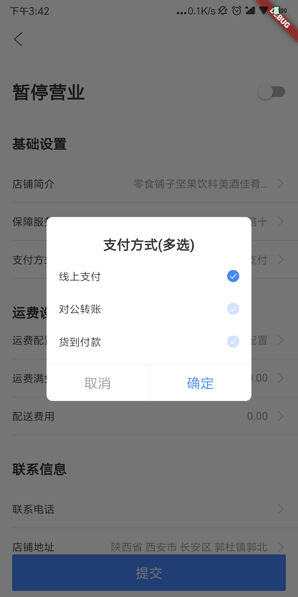   |   |    |
| 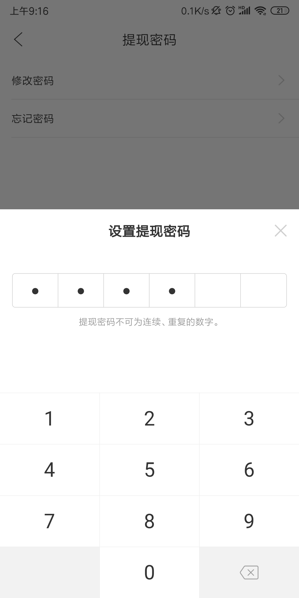   |     |   |  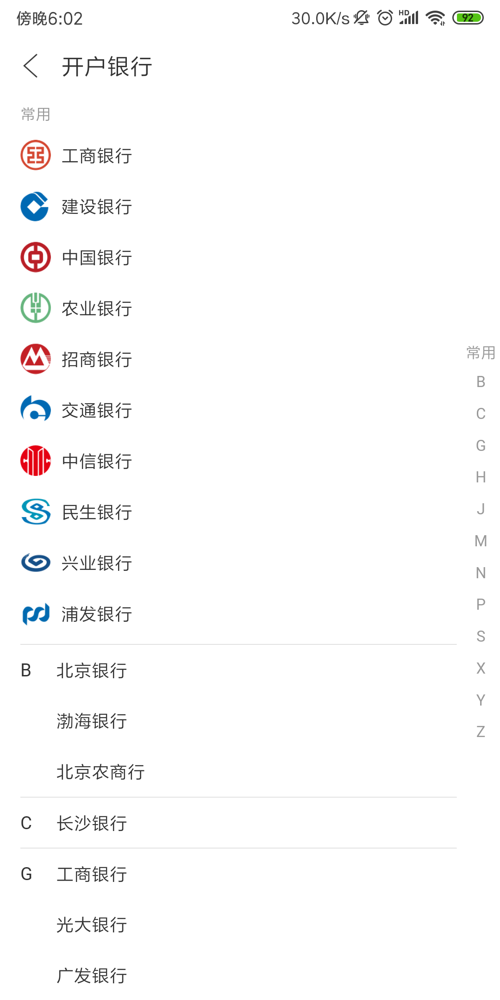  |
| 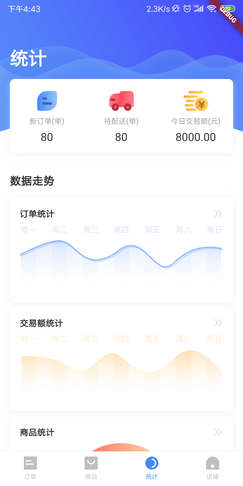   |  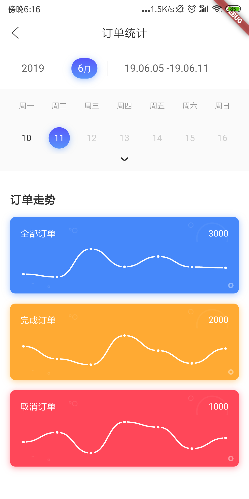   | 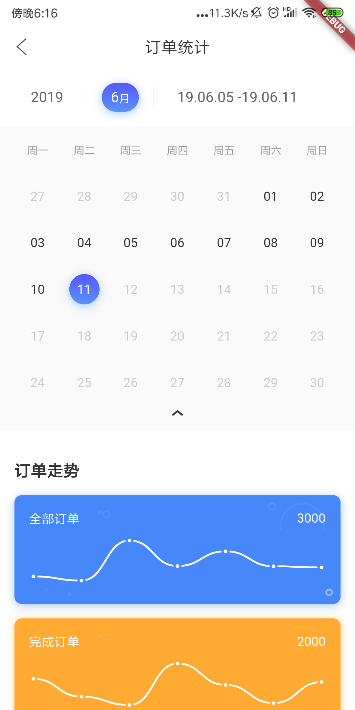  |  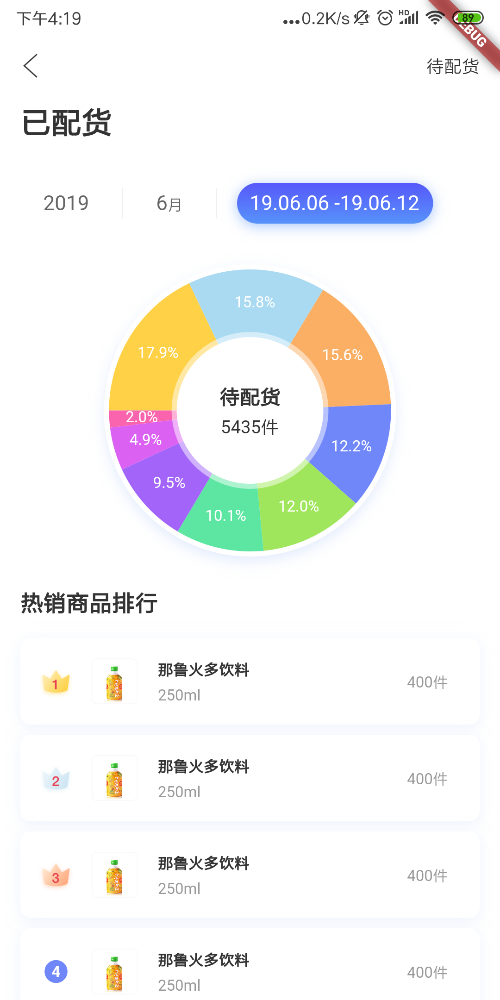  |
| 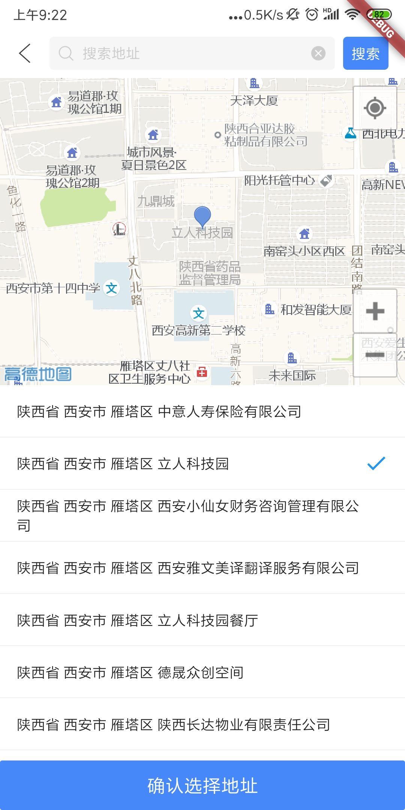   |  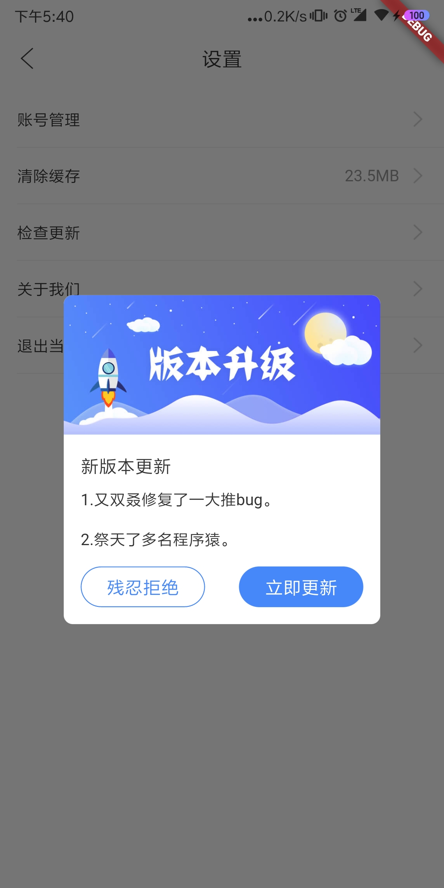   |   |  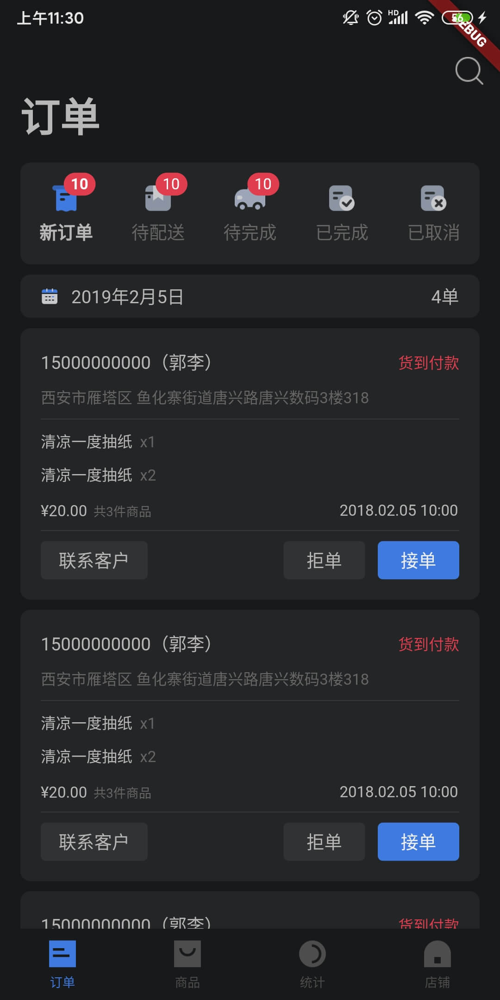  |
|    |  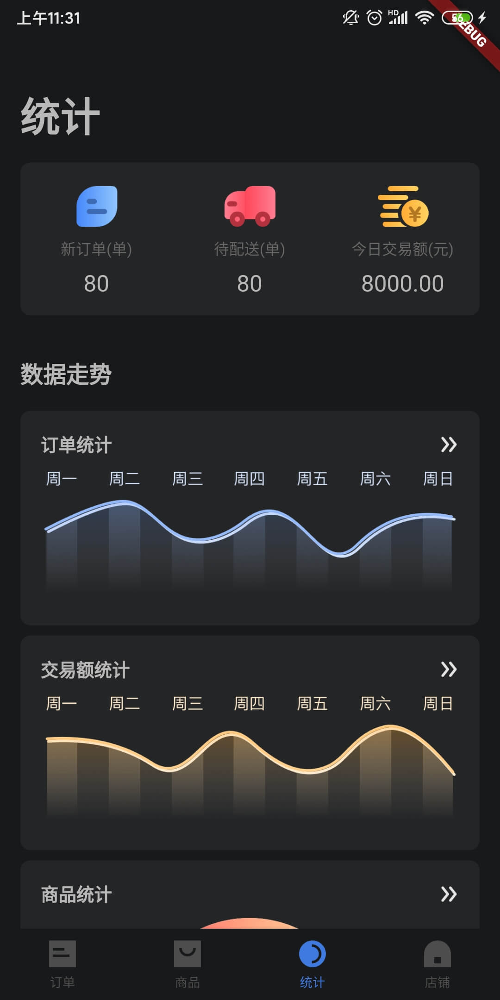   |  |  |

## Content

* mvp mode
* Use `provider`(version 5.x) for state management
* Network request encapsulation based on `dio` (version 4.x)
* Driver testing, accessibility testing.
* Support dark mode
* Localization（Thanks @ghedwards）  
* Use `Sliver` series of components to achieve complex scrolling effects
* Use amap Positioning to select address
* Pull down to refresh + pull up to load more
* Check update
* PopupWindow
* Scan code（qr_code_scanner plugin）
* Menu switching animation (circular diffusion, 3D flip)
* Sliding delete
* City selection
* Similar to the three-level linkage of Jingdong's choice of cities
* Custom Dialog
* Sticky headers
* Password input keyboard
* Verification code input
* Custom Simple Calendar
* Graphs and [pie charts](https://dartpad.cn/d06f8f737d6eb2d87978eb2d14b87864)
* Modular routing management
* More optimization

Android package：[Click to download](https://www.pgyer.com/gYXj)，Password: `111111`。

iOS and Web needs to download the code to run.

Web：https://simplezhli.github.io/flutter_deer/

## Project environment

    1. Flutter version 2.0.3

    2. Dart version 2.12.2

## Precautions

- iOS can execute commands `flutter build ios` to create `release` versions. Android can execute commands `flutter build apk` to create `release` versions.

- If there is a problem with the project, you can try to find a solution in the [iOS problem summary](./docs/iOS问题汇总.md) and [Android problem summary](./docs/Android问题汇总.md).

- Due to some plug-ins, this project has imperfect support on the Windows and macOS. Those who are interested can run the experience by themselves.
        
- You can execute integration test commands to `flutter drive --target=test_driver/driver.dart` view function demonstrations.

- I have added a relative path to the design drawings in the page notes. I can search or find the corresponding page. I hope it will help you.

- This project uses the FlutterJsonBeanFactory plugin to generate beans. 

## Summary of experience

- [Flutter开发中的一些Tips(一)](https://weilu.blog.csdn.net/article/details/90546727)

- [Flutter开发中的一些Tips(二)](https://weilu.blog.csdn.net/article/details/94849020)

- [Flutter开发中的一些Tips(三)](https://weilu.blog.csdn.net/article/details/100108123)

- [Flutter适配深色模式（DarkMode）](https://weilu.blog.csdn.net/article/details/102531559)

- [说说Flutter中的RepaintBoundary](https://weilu.blog.csdn.net/article/details/103452637)

- [说说Flutter中的Semantics](https://weilu.blog.csdn.net/article/details/103823259)

- [说说Flutter中最熟悉的陌生人 —— Key](https://weilu.blog.csdn.net/article/details/104745624)

- [说说Flutter中的无名英雄 —— Focus](https://weilu.blog.csdn.net/article/details/107132031)

- [Flutter性能优化实践 —— UI篇](https://weilu.blog.csdn.net/article/details/106046434)

- [玩玩Flutter的拖拽——实现一款万能遥控器](https://weilu.blog.csdn.net/article/details/105237677)

- [玩玩Flutter Web —— 实现高德地图插件](https://weilu.blog.csdn.net/article/details/106465792)

- [在GitHub Actions上进行Flutter 的测试和部署](https://weilu.blog.csdn.net/article/details/114744416)

- [Flutter动画曲线Curves 效果一览](https://weilu.blog.csdn.net/article/details/95632571)

- [Flutter状态管理之Riverpod](https://weilu.blog.csdn.net/article/details/108352306)

- [【译】正确操作Dart中的字符串](https://weilu.blog.csdn.net/article/details/107857569)

- [【译】学习Flutter中新的Navigator和Router系统](https://weilu.blog.csdn.net/article/details/108902282)
    
## Tripartite library used

| 库                         | 功能             |
| -------------------------- | --------------- |
| [dio](https://github.com/flutterchina/dio)                            | **Network library**       |
| [provider](https://github.com/rrousselGit/provider)                   | **State management**     |
| [flutter_2d_amap](https://github.com/simplezhli/flutter_2d_amap)      | **2D AMap**   |
| [cached_network_image](https://github.com/renefloor/flutter_cached_network_image)       | **Image loading**       |
| [fluro](https://github.com/theyakka/fluro)                            | **Route**     |
| [flutter_oktoast](https://github.com/OpenFlutter/flutter_oktoast)     | **Toast**        |
| [common_utils](https://github.com/Sky24n/common_utils)                | **Dart common utils library**     |
| [flutter_slidable](https://github.com/letsar/flutter_slidable)        | **Sliding delete**     |
| [flustars](https://github.com/Sky24n/flustars)                        | **Flutter common utils library**       |
| [flutter_swiper](https://github.com/best-flutter/flutter_swiper)      | **Flutter banner component**       |
| [url_launcher](https://github.com/flutter/plugins/tree/master/packages/url_launcher)   | **Launch URL plugin**       |
| [image_picker](https://github.com/flutter/plugins/tree/master/packages/image_picker)   | **Picture selection plugin** |
| [rxdart](https://github.com/ReactiveX/rxdart)                         | **Dart responsive extension** |
| [webview_flutter](https://github.com/flutter/plugins/tree/master/packages/webview_flutter)    | **WebView plugin**       |
| [keyboard_actions](https://github.com/diegoveloper/flutter_keyboard_actions)                  | **Keyboard actions**       |
| [sticky_headers](https://github.com/fluttercommunity/flutter_sticky_headers)   | **Sticky headers**       |
| [azlistview](https://github.com/flutterchina/azlistview)              | **City selection list**   |
| [date_utils](https://github.com/apptreesoftware/date_utils)           | **Commonly used date tools** |
| [bezier_chart](https://github.com/aeyrium/bezier-chart)               | **Bezier chart**       |
| [sprintf](https://github.com/Naddiseo/dart-sprintf)                   | **Format String**   |
| [qr_code_scanner](https://github.com/juliuscanute/qr_code_scanner)     | **Scan code** |
| [intl](https://github.com/dart-lang/intl)     | **Localization** |
| [vibration](https://github.com/benjamindean/flutter_vibration)     | **Vibration** |

For details, please refer to the [pubspec.yaml](https://github.com/simplezhli/flutter_deer/blob/master/pubspec.yaml) file.  

## Plan:

* [x] Web support.

* [ ] Migrate to null-safety.

## Thanks For

- [flutter_wanandroid](https://github.com/Sky24n/flutter_wanandroid)

## License

	Copyright 2019 simplezhli

    Licensed under the Apache License, Version 2.0 (the "License");
    you may not use this file except in compliance with the License.
    You may obtain a copy of the License at

       http://www.apache.org/licenses/LICENSE-2.0

    Unless required by applicable law or agreed to in writing, software
    distributed under the License is distributed on an "AS IS" BASIS,
    WITHOUT WARRANTIES OR CONDITIONS OF ANY KIND, either express or implied.
    See the License for the specific language governing permissions and
    limitations under the License.
